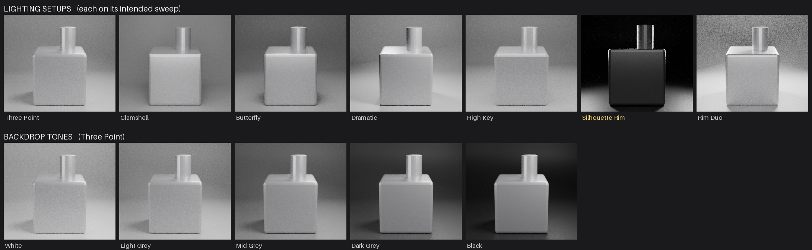
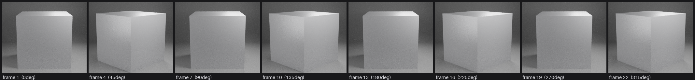
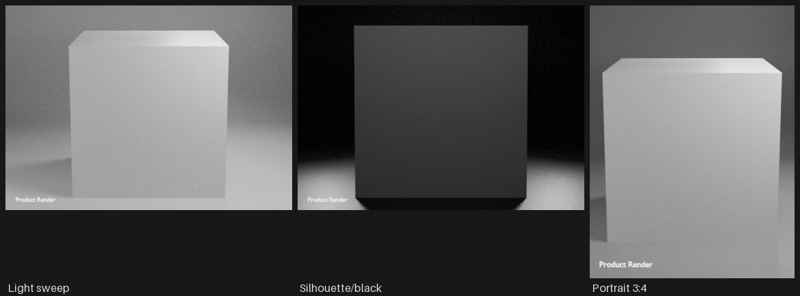
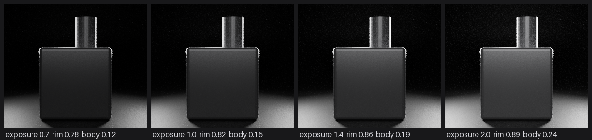

# Studio Render Presets

A Blender add-on for product rendering. Pick a resolution preset, build a lit
studio around whatever you have selected, and render.

Every number in it — light power, exposure, memory estimates, render times —
was set by measuring renders, not by eye.



## Features

- **Render presets** — Quick / 2K / 4K / 8K, each setting resolution, sampling,
  bounces, denoising and output format in one press.
- **Product Studio** — seven lighting setups and a seamless cyclorama, sized
  automatically from the bounding box of your selection.
- **Turntable** — a seamless 360° loop where the rig orbits and your model
  never moves.
- **Watermark** — text in any corner, drawn at render resolution.
- **Animation output** — MP4, WebM, ProRes, lossless MKV or a PNG sequence,
  picked once and used by everything that renders.
- **Scene Check** — finds the usual reasons a render comes out dark or wrong.
- **Measured render-time estimates** — calibrates against your machine, and
  refines itself after every render.

## Install

Download the latest `studio_render_presets-*.zip` from
[Releases](../../releases) and install it through
**Preferences → Add-ons → Install from Disk**.

Requires **Blender 4.2 or newer**. Developed and tested against 5.0.

The panel appears in the 3D viewport sidebar (press **N**) under a **Studio**
tab.

## Quick start

1. Select your part — multi-object assemblies are fine.
2. Open **Product Studio**, tick **Add Camera**, press **Build Product Studio**.
3. Change the **Setup** dropdown and press Build again to compare looks.
   Exposure stays constant between setups, so you are comparing the lighting.
4. Pick a resolution in **Studio Render**, press **Calibrate** once, read the
   time estimate.
5. **Apply + Render**.

## Lighting setups

| Setup | Lights | For |
| --- | --- | --- |
| Three Point | Key, Fill, Rim | The dependable all-rounder |
| Clamshell | Top, Bottom | Very even — jewellery and small parts |
| Butterfly | Key, Fill, Rim | Symmetric shadows under overhangs |
| Dramatic | Key, Rim | Deep shadows; pair with a dark sweep |
| High Key | Front, Left, Right, Wash | Shadowless catalogue look |
| Silhouette Rim | Rim L, Rim R, Crown, Whisper | Glowing outline, dark body |
| Rim Duo | Rim L, Rim R, Fill | Edge-lit on black |



## Watermark

Text in any corner, parented to the camera and drawn at render resolution, so
it stays the same size whatever the output. It is invisible to every ray type
except camera — it cannot light the product, cast a shadow, or turn up in a
reflection.



## Animation output

| Format | Alpha | For |
| --- | --- | --- |
| MP4 / H.264 | no | Plays anywhere. The one to send someone |
| MP4 / H.265 | no | Half the size at matched quality, fussier to open |
| WebM / VP9 | **yes** | A web page, and the only video option here that keeps alpha |
| QuickTime / ProRes | no | Large and barely compressed, for an editor |
| MKV / FFV1 | **yes** | Mathematically lossless archive. Very large |
| PNG sequence | yes | A frame per file — needed for GIF, safest to re-encode from |

Order matters when setting these, which is why it is done in one place: the
codec filters what colour modes and bit depths are legal, so asking for RGBA
before choosing WebM silently gets you RGB.

**GIF is not in that list because Blender cannot write one.** Its containers
are MPEG-4, MKV, WebM, AVI, DV, Flash, MPEG-1/2, Ogg and QuickTime — there is
no GIF encoder, and a decent GIF needs a per-clip palette besides. Render a
PNG sequence and press **Copy GIF Command** for a two-pass `ffmpeg` line that
builds the palette and applies it. The add-on deliberately does not shell out
to `ffmpeg` itself: an extension is not allowed to depend on external
software being installed.

## Why the numbers are what they are

Irradiance falls off as `P / (4πd²)`, and rig distance scales with object size,
so light power must scale with the **square** of the radius. A rig built with
fixed wattage is exactly why a scaled-up scene renders dark. Power is solved
from a target irradiance instead — building on a 10 mm part, a 1 m part and a
100 m part gives key powers of 0.015 W, 154 W and 1,544,158 W, and all three
render at identical brightness.

At high resolution the **denoiser**, not the raytracing, dominates memory.
Measured at 4096×4096 with everything else constant:

| Denoising | Peak memory |
| --- | --- |
| Off | 1.67 GB |
| RGB + Albedo, Fast | 3.88 GB |
| RGB + Albedo + Normal, Accurate | 5.34 GB |

That 3.2× spread is why the 8K preset turns denoising off and pays for
cleanliness with samples instead.

Render time fits `time = overhead + k × megapixels` with an R² of 0.99998, so
two quick calibration renders predict a full-size render to within a few
percent.

Rim-heavy setups throw most of their light away from camera, so each setup
carries an exposure correction solved against an 18% grey sphere — Rim Duo
needed 2.597×, Clamshell 0.606×. All of them land within 0.505–0.514, so
switching setup changes the look and not the brightness.

Silhouette Rim is the setup where that correction is easiest to see. Exposure
sets how far the glow creeps in from the edges, and the body barely moves:



## Known limits

- The memory estimate is the weakest number here: measured on CPU in a 7 GB
  container on a light scene, and memory scales sub-linearly with pixel count.
  The panel shows a range rather than a figure. Raise **Scene Overhead** in
  preferences for heavy models.
- Rim Duo and Silhouette Rim render noisier at matched samples — their
  illumination is mostly indirect.
- Render-time calibration is per scene; a much heavier model needs a re-run.
- The rig is rebuilt rather than edited, so hand adjustments are lost on the
  next Build.
- GIF has to be made outside Blender; the panel hands you the `ffmpeg`
  command for it.
- Not handled: depth of field, HDRI-based lighting as a setup, per-light colour
  temperature, material assignment.

## Building from source

```bash
./build.sh      # -> dist/studio_render_presets-<version>.zip
```

The add-on is a single `__init__.py` plus `blender_manifest.toml`. The preset
tables are plain dictionaries at the top of the file — `PRESETS`,
`OUTPUT_FORMATS`, `LIGHT_SETUPS`, `BACKDROP_TONES` and `KEY_IRRADIANCE`. If you change a setup's
light ratios, its `exposure` value needs re-solving to keep brightness
consistent with the others.

## License

GPL-3.0-or-later. See [LICENSE](LICENSE).

Blender add-ons link against Blender's Python API, which is GPL, so this is the
required license rather than a preference.
